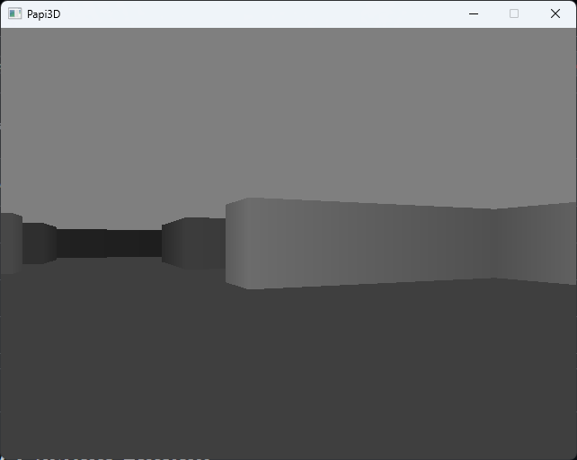
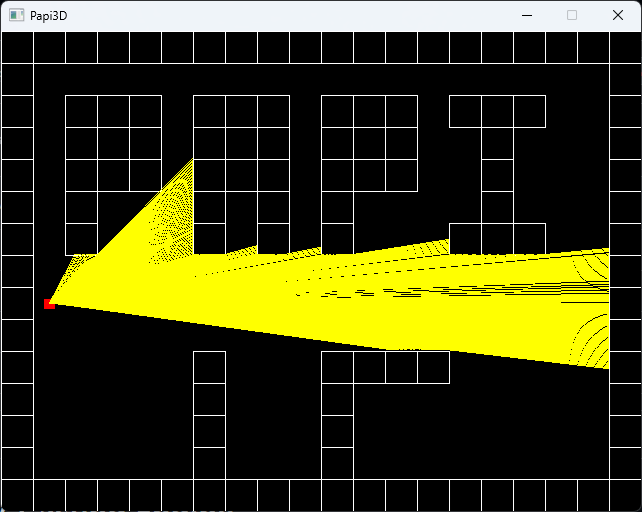

# FPS Ray-Casting Engine

 

A simple first-person ray-casting engine built in C++ using SDL2, similar to Wolfenstein 3D by ID Software.

## Features

- Real-time ray-casting rendering
- Player movement (WASD controls)
- Toggle between 2D map view and 3D perspective (E key)
- Distance-based lighting effects
- Fixed-point arithmetic for performance


### Project Structure

```
/
├── src/                 # Game source code
│   ├── main.cpp         # Main game loop
│   ├── graphics.cpp     # Rendering functions
│   ├── map.cpp          # Map rendering
│   ├── player.cpp       # Player logic and ray-casting
│   ├── pfloat.h         # Papi3D Float Implementation
└   └── constants.cpp    # App constants
```

### Controls

- **W/S**: Move forward/backward
- **A/D**: Turn left/right
- **E**: Toggle between 2D map view and 3D view
- **Q** or **ESC**: Quit the game


## Technical Details

- Uses fixed-point arithmetic for better performance
- Ray-casting algorithm with DDA (Digital Differential Analyzer)
- Software rendering directly to SDL2 surface

## License

This project uses SDL2, which is licensed under the zlib license. See the SDL2 source code for details.

